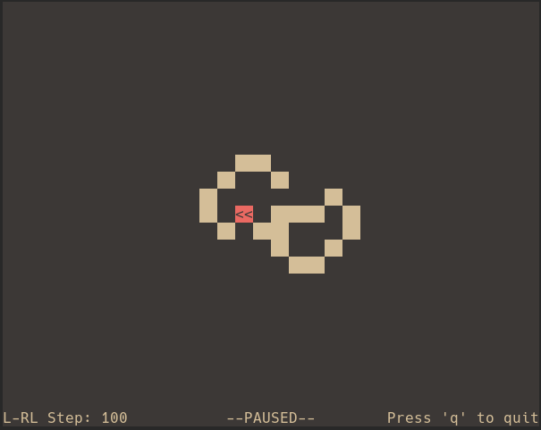
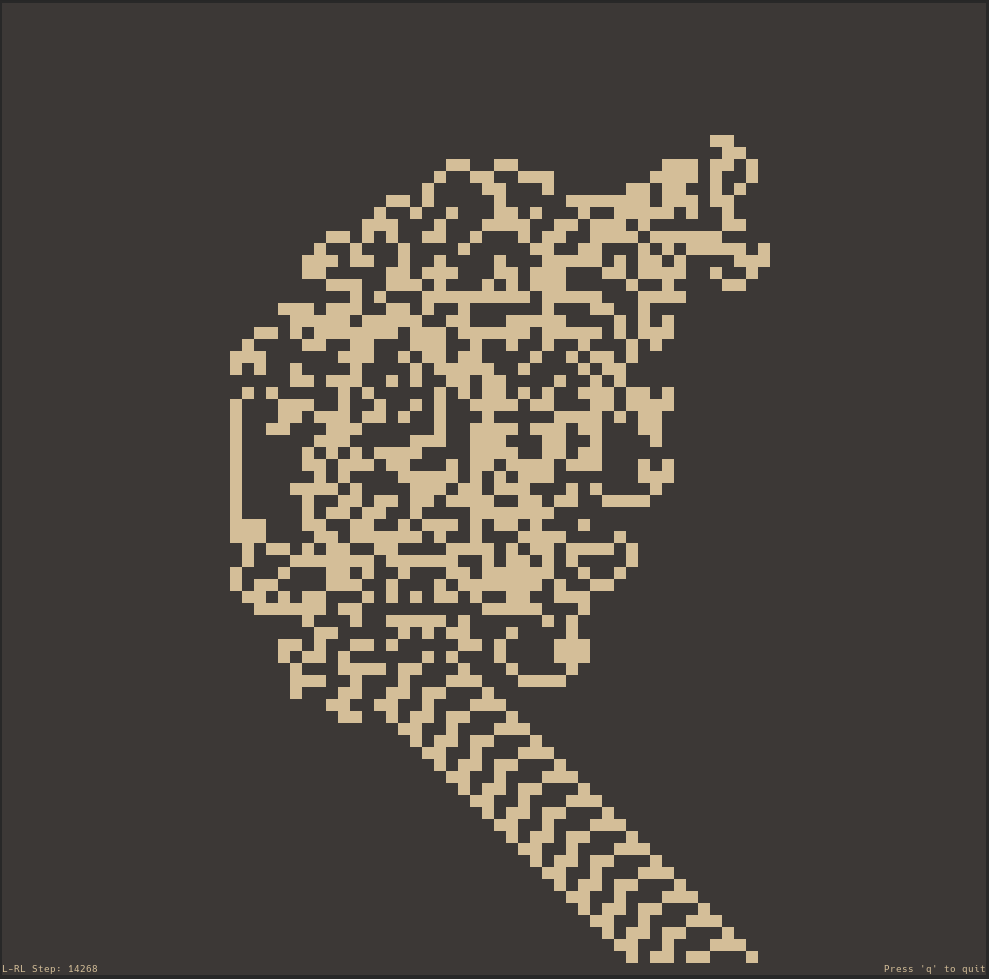
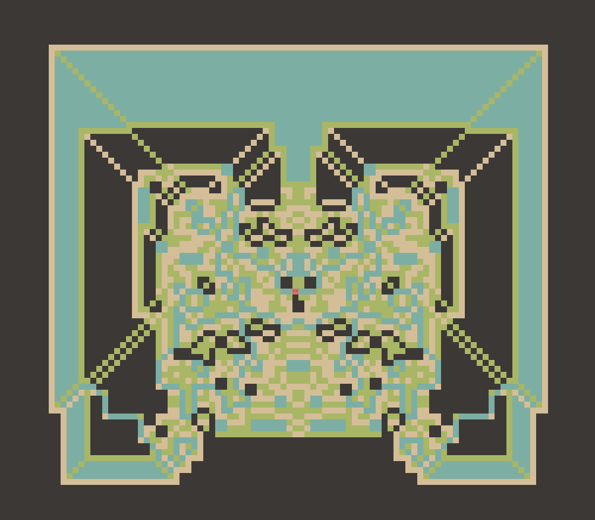
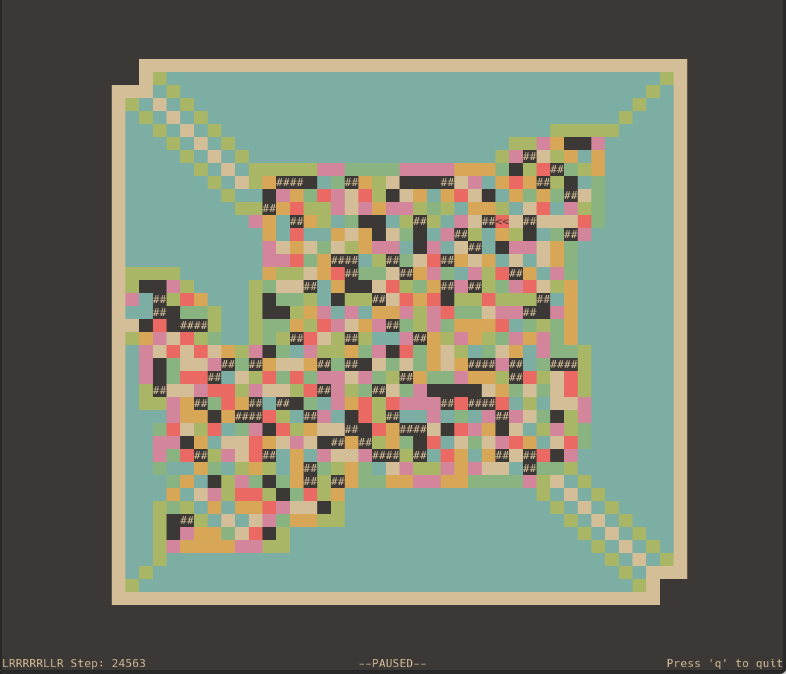
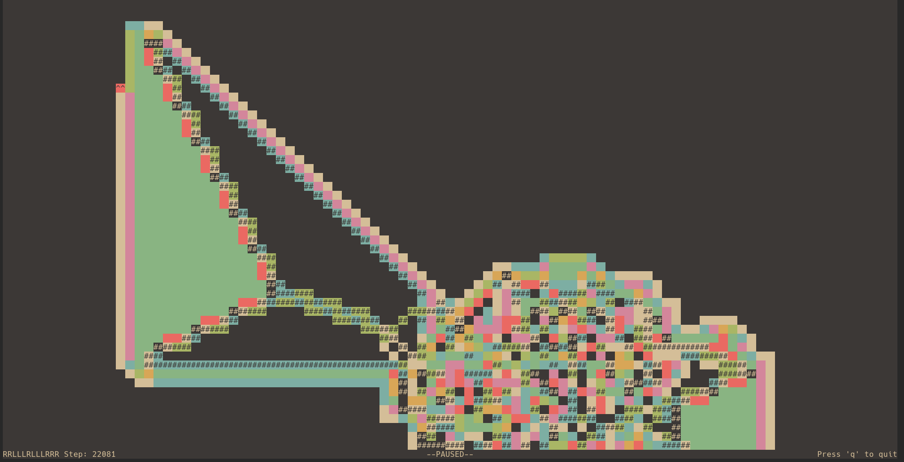

# c-langtons-ant

Langton's ant on the command-line, written in C with ncurses.

<p align="center">
    
</p>

## Installation

```
git clone https://github.com/mcmangini/c-langtons-ant.git
cd c-langtons-ant/src
make
```

## Usage

```
./langtons_ant [OPTION] [PATTERN]
```

### Options

- `-d <direction>`
    - Specify ant's starting direction
        - `L` or `l` (left)
        - `R` or `r` (right)
        - `U` or `u` (up)
        - `D` or `d` (down)
- `-h, --help`
    - Display usage message

### Pattern

Pattern is a string between two and sixteen characters in length. The length of pattern determines the number of colors used by the ant. Each character represents a rule for a specific color. For example, the pattern `LRRL` means:

- Turn left on a tile of color one (black)
- Turn right on a tile of color two (white)
- Turn right on a tile of color three (blue)
- Turn left on a tile of color four (green)

Tiles change color in a cyclical fashion (black -> white -> blue -> green -> black).

Valid pattern characters are:

- `L` or `l` (left turn)
- `R` or `r` (right turn)
- `U` or `u` (u-turn)
- `N` or `n` (none)

### Application Controls

- `q` - Quit
- `p` - Pause/Resume
- `r` - Restart
- `1` - Slow ant speed
- `2` - Medium ant speed
- `3` - Fast ant speed
- `Arrow keys` - Pan around grid
- `a` - Center ant
- `c` - Center grid

## Examples

- RL

<p align="center">
    
</p>

- RLLR

<p align="center">
    
</p>

- LRRRRRLLR

<p align="center">
    
</p>

- RRLLLRLLLRRR

<p align="center">
    
</p>
